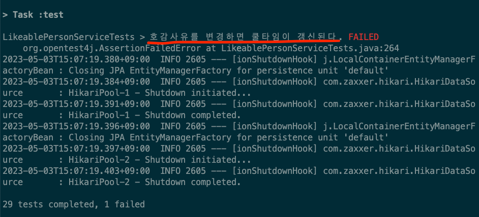
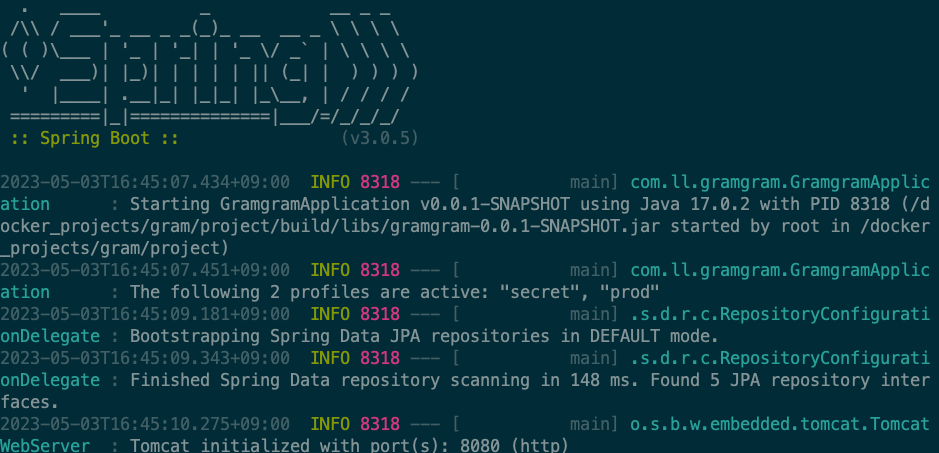
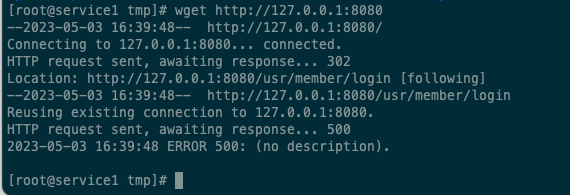

‘어떻게 개발을 진행 할 것인지에 대한 방향성’을 확인하는 과정이기 때문에 최대한 깊이있게 분석 후 진행해주시기 바랍니다.

### [1 번째 필수미션] 

- 호감표시/호감사유변경 후, 개별 호감표시건에 대해서, 3시간 동안은 호감취소와 호감사유변경을 할 수 없도록 작업

**배경**

현재 UI에서는 이 요구사항에 대한 작업이 완료되었습니다.

이 요구 사항 -> 호감 표시/사유 변경을 할 수 있는 UI

어떤 부분인지 찾아보자


백엔드 쪽에서 체크하는 로직만 추가하면 됩니다. (해야할 부분)

**[목표]**

1. 호감표시를 한 후 개별호감표시건에 대해서, 3시간 동안은 호감취소와 호감사유변경을 할 수 없도록 작업
2. 호감사유변경을 한 후 개별호감표시건에 대해서, 3시간 동안은 호감취소와 호감사유변경을 할 수 없도록 작업

**[1번목표에 대한 나의 접근법]**

- 일단 호감 표시가 어떻게 어떤 로직으로 이루어지는지 파악
- 호감 표시를 하면 modifyUnlockDate가 like()에서 갱신됨 (이 부분을 못찾았었음)
- 그럼 취소나 사유 변경이 발생할 때(LikeablePerson의 테이블에서 toInstaMember에 대해서)
- 해당 행의 modifyUnlockDate를 확인하고 isModifyUnlocked()가 true가 아니라면 변경 거부 (RsData) 리턴하기!

[성공코드 수정으로 서버가 실행이 되지 않는 이슈가 있었지만 해결해주었다.]
- canLike() 메서드의 S-2 성공코드는 호감 표시가 중복으로 되어있을 때 반환되는 코드인데 코드 순서를 바꿔놓아 호감표시가 없는데 S-2 코드에 걸려 `NullPointerException` 이 발생했었음 

### 2번째 필수 미션 시작

네이버 클라우드 플랫폼을 이용한 그램그램 배포

### [네이버 클라우드 플랫폼을 활용해서 그램그램 배포해보기]

---

서버를 생성하고 설정을 할 때에 인증키 설정에서 생성을 하게 되는데 이건 꼭 따로 가지고 있어야 한다..!


얘가 있어야 서버 리눅스의 비밀번호를 까먹더라도 다시 이 인증키를 통해 복구할 수 있다.

다음으로 넘어가면 신규 ACG라는 말이 나온다. 방화벽을 설정하는 부분이다!!

그럼 오픈할 부분을 정해야 하는데


집에서만 접근할 수 있도록 하는 방화벽을 열어두는 설정

나머지 포트 설정을 해주고 난 뒤 생성을 마치면 이런 알림이 뜨는데 이후 의미 해석을 위해서 남겨 놓았다.


더 자세한 ACG에 대한 설명은 강사님의 필기를 인용했다.

- 80번포트 / 0.0.0.0/0
  - HTTP, 웹서비스용 포트
- 81번포트 / 0.0.0.0/0
  - NGINX PROXY MANAGER 관리용 포트
- 443번포트 / 0.0.0.0/0
  - HTTPS, 웹서비스용 포트
- 22번포트 / MyIP
  - 리눅스 원격접속용 포트, 개발자 본인만 접속하면 되니까 MyIP
- 3306번포트 / MyIP
  - 리눅스에 설치된 MySQL 관리용 포트, 개발자 본인만 접속하면 되니까 MyIP

**포트 포워딩을 해주어야 하는데 포트 포워딩을 왜 해주는 것일까?**

---

한번에 들어가는게 아니라 우회해서 들어간다..? 보안 때문에 → 근데 왜 우회해서 들어가는가?

⇒ 해커들의 공격을 막기 위해서!

나는 2226 포트로 설정을 해주었다.

포트 포워팅을 하고 서버 접속용 공인 IP를 발급 받으면 된다. 나는 다음의 IP를 받았다.

118.67.143.238

원래라면 root@118.67.143.238로 들어갔어야 한다.

근데 포트 포워딩을 하고 나면 접속용 IP가 따로 존재한다.

포트 포워딩을 통해 받은 서버 접속용 공인 IP인 root@106.10.37.54로 접속하면 root@118.67.143.238로 접속된다.

원래라면

ssh -p 22 root@118.67.143.238 로 바로 들어가야하는데

포트 포워딩 설정을 해주면 바로 22번 포트로 들어가는게 막히고

ssh -p 2226 root@106.10.37.54 로 우회해서 22번 포트로 들어가는 길이 열린다

이유는 보안 때문!!!!! 일단 그렇게만 알아두자

### yum update -y 를 해주는 이유 → 리눅스, 도커관련

---

업데이트를 하면서 악성코드가 심어질 위험은 있지만 최신버전으로 업데이트 되면서 이전에 보안이 낮거나 좋지 않은 코드들을 업데이트를 진행하면서 검사를 해주기 때문에 보안성이 높아진다.

### yum -y install wget curl → 리눅스, 도커관련

---

**`wget`**는 HTTP, HTTPS, FTP 프로토콜을 사용하여 파일을 다운로드하는 명령어

**`curl`**은 URL을 사용하여 데이터를 전송하고 수신하는 명령어

두 명령어는 대부분의 리눅스 배포판에서 기본적으로 제공되지 않기 때문에,

YUM을 사용하여 설치해야 한다.

이러한 명령어는 주로 웹에서 파일을 다운로드하거나, API와 통신할 때 사용한다!!

그램그램 배포를 위해 java17을 다운받아야 해서 이 명령어가 필요하다.

### /tmp 폴더 → 리눅스, 도커 관련

---

뭔가를 작업하고 설치하고 작업을 끝난 뒤 다시 삭제를 해야하는 수고로움이 발생할 수 있다. 이때 이 /tmp 파일을 사용해서 이 안에서 작업하게 되면 나중에 언젠간 tmp폴더는 지워지기 때문에 이 안에서 작업 같은것을 하면 된다!

### • ./gradlew clean build 빌드 시 오류 발생

---

빌드를 진행할 때에 test가 수행되어지는데 이 부분은 테스트가 통과되지 않으면 빌드가 되지 않음



@Test
@DisplayName("호감사유를 변경하면 쿨타임이 갱신된다.")
void t008() throws Exception {
// 현재시점 기준에서 쿨타임이 다 차는 시간을 구한다.(미래)
LocalDateTime coolTime = AppConfig.genLikeablePersonModifyUnlockDate();

```java
  @Test
  @DisplayName("호감사유를 변경하면 쿨타임이 갱신된다.")
  void t008() throws Exception {
          // 현재시점 기준에서 쿨타임이 다 차는 시간을 구한다.(미래)
          LocalDateTime coolTime = AppConfig.genLikeablePersonModifyUnlockDate();
  
          Member memberUser3 = memberService.findByUsername("user3").orElseThrow();
          // 호감표시를 생성한다.
          LikeablePerson likeablePersonToBts = likeablePersonService.like(memberUser3, "bts", 3).getData();
  
          // 호감표시를 생성하면 쿨타임이 지정되기 때문에, 그래서 바로 수정이 안된다.
          // 그래서 강제로 쿨타임이 지난것으로 만든다.
          // 테스트를 위해서 억지로 값을 넣는다.
          TestUt.setFieldValue(likeablePersonToBts, "modifyUnlockDate", LocalDateTime.now().minusSeconds(1));
  
          // 수정을 하면 쿨타임이 갱신된다.
          likeablePersonService.modifyAttractive(memberUser3, likeablePersonToBts, 1);
  
          // 갱신 되었는지 확인
          assertThat(
            likeablePersonToBts.getModifyUnlockDate().isAfter(coolTime)
          ).isTrue();
    }
```

다음 테스트 코드에서 에러가 발생했는데 원래 코드는 minusSeconds(-1)이 되어 있었다

```java
TestUt.setFieldValue(likeablePersonToBts, "modifyUnlockDate", LocalDateTime.now().minusSeconds(-1));
```

그렇게 되면 -(-1)이 되어 modifyAttractive()에서 canModify()를 진행할 때에 현재 시간보다 더 이후로 기록되어진다.

그래서 통과가 안되었음. 1로 바꿔주고 진행

해결


**문제 발생**

---

실행은 잘 되는데 wget으로 접속 시 다음과 같은 에러 발생


