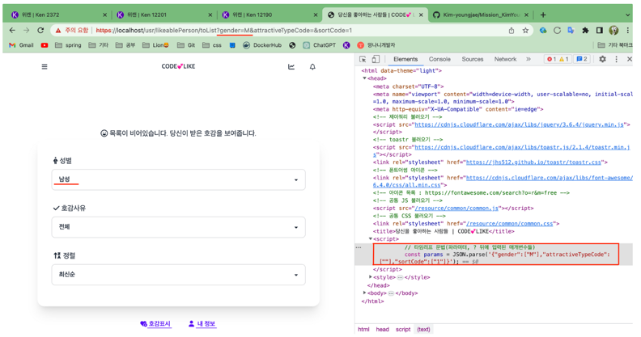

### 1. 내가 받은 호감 리스트 성별 필터링 기능 구현

---

1번 문제 파악하기


일단 form으로 쏴줄 때에 파라미터가 넘어오는데 이를 성별, 호감사유 정렬코드가 넘어온다.

현재 막힌 문제

```java
if (instaMember != null) {
  // 해당 인스타회원이 좋아하는 사람들 목록
  List<LikeablePerson> likeablePeople = instaMember.getToLikeablePeople();
```

호감 목록에 정보들이 등록되어 있지만 가져오지 못한다.

**아.. insta_user3을 좋아하는 사람이 등록되어 있지 않기 때문에 뜨지 않는 것이었다.. 진짜 문제를 잘 읽자..**

자 이제 이 부분을 필터링을 해야한다.

form에서 get요청으로 올 때에 URL을 통해 넘어오는 파라미터를 @RequestParam을 통해 컨트롤러에서 gender를 받아왔다. 그리고 filterByGender()의 매개변수로 likeablePeople과 gender를 서비스 사이드로 넘겨주어 처리하였다.

**filterByGender()**

```java
public List<LikeablePerson> filterByGender(List<LikeablePerson> likeablePeople, String gender) {

        List<LikeablePerson> filteredData = new ArrayList<>();

        switch (gender) {
            case "":
                return likeablePeople;
            case "M":
                for (int i = 0; i < likeablePeople.size(); i++) {
                    InstaMember fromInstaMember = likeablePeople.get(i).getFromInstaMember();
                    if (fromInstaMember.getGender().equals("M")) {
                        filteredData.add(likeablePeople.get(i));
                    }
                }
                break;
            case "W":
                for (int i = 0; i < likeablePeople.size(); i++) {
                    InstaMember fromInstaMember = likeablePeople.get(i).getFromInstaMember();
                    if (fromInstaMember.getGender().equals("W")) {
                        filteredData.add(likeablePeople.get(i));
                    }
                }
                break;
        }

        return filteredData;
    }
```

switch-case를 사용하여 필터링해주었는데 우선 동작을 제대로 한다. 하지만 필터링할 때에 저 반복문이 중복으로 들어가기 때문에 리팩토링이 필요할 것 같다.